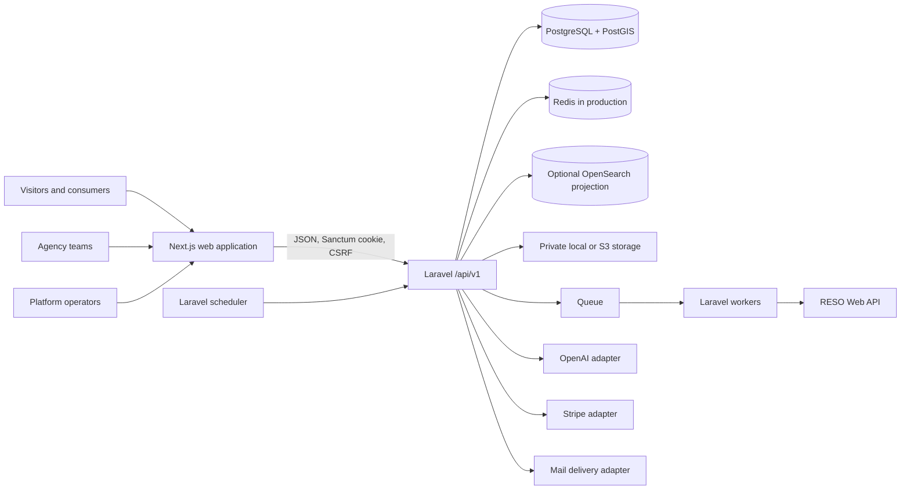

# Casaura

Casaura is an API-first, multi-tenant real-estate marketplace and agency operating platform. It combines public property discovery, consumer collaboration, listing and lead management, agency growth tools, platform administration, licensed property-data ingestion, grounded AI assistance, and subscription billing in one repository.

> **Release status:** The repository contains the engineering release candidate for Phases 1–10. The product is not approved for production launch yet. Live infrastructure, legal and privacy approval, production mail, licensed RESO data, OpenAI, Stripe, operational exercises, and the repository deployment issues documented below must be completed before traffic is accepted.

The proposed engineering launch profile is agency-first, United States, USD, with square feet as the configured area unit. External approval is still required. Casaura is currently a working product name and also requires trademark review before a public launch.

## Contents

- [What Casaura is](#what-casaura-is)
- [Quick start](#quick-start)
- [Who Casaura serves](#who-casaura-serves)
- [Implemented product scope](#implemented-product-scope)
- [Roles, permissions, and feature availability](#roles-permissions-and-feature-availability)
- [Architecture](#architecture)
- [API contract and conventions](#api-contract-and-conventions)
- [Technology stack](#technology-stack)
- [Repository structure](#repository-structure)
- [Local development](#local-development)
- [Configuration](#configuration)
- [Development and quality commands](#development-and-quality-commands)
- [Browser testing](#browser-testing)
- [Current verification](#current-verification)
- [CI and release automation](#ci-and-release-automation)
- [Production deployment](#production-deployment)
- [Current production blockers](#current-production-blockers)
- [Documentation map](#documentation-map)
- [License](#license)

## What Casaura is

Casaura brings the public marketplace and the agency back office into the same product:

- Home seekers can search published inventory, inspect privacy-safe locations, compare properties, organize collections, contact the responsible agency, coordinate viewings, and manage their personal data.
- Agency teams can register a tenant, create and publish listings, manage secure media, work leads and conversations, schedule viewings, maintain a public storefront, configure data feeds, and manage plan-backed capabilities.
- Platform operators can moderate reports, manage feature availability and roles, review health and audit data, inspect AI safety evidence, and govern promotion policies.

This is not only a static interface prototype. Search, property detail, authentication, account, agency, integration, AI, and administration workflows use the Laravel API and persistent domain models. The home page includes bundled presentation content during `next dev`, but operational screens do not silently replace unavailable API data with fake records.

Casaura is built as a modular monolith. PostgreSQL/PostGIS is the authoritative data store; Redis, OpenSearch, object storage, provider APIs, and external delivery systems sit behind replaceable boundaries. The Next.js application and Laravel API can be deployed independently while remaining coordinated through a versioned OpenAPI contract and shared CI.

### What this repository does not provide

The repository does not include a production hosting account, DNS/TLS/WAF configuration, managed databases, a secret manager, provider contracts, real credentials, production legal approval, or completed operational sign-off. It also does not currently provide:

- native mobile applications or a public partner-token issuance flow;
- WebSocket/server-push messaging—conversations use bounded cursor polling;
- production newsletter delivery—the current adapter is a development stub and production sends fail closed;
- shared demo users, agencies, or listings from the database seeder;
- a turnkey infrastructure-as-code platform—the production Compose file is a process and environment contract;
- complete runtime request/response schema validation against OpenAPI; CI currently enforces lint validity and route/method parity.

## Quick start

For a clean checkout, install the root web workspace and Laravel dependencies, start PostgreSQL/Mailpit, then initialize the API:

```bash
cp .env.example .env
npm ci --ignore-scripts
docker compose up --detach --wait --wait-timeout 300 postgres mailpit

cd apps/api
cp .env.example .env
composer install --no-interaction --prefer-dist
php artisan key:generate
php artisan migrate --seed
cd ../..
```

Run `php artisan serve` from `apps/api` and `npm run dev:web` from the repository root in separate terminals, then open [http://localhost:3000](http://localhost:3000). This starts the basic application; the [complete local-development guide](#local-development) adds the queue worker, scheduler, optional adapters, URLs, account bootstrap, and configuration notes.

## Who Casaura serves

| Audience | Main workflows | Primary web surfaces |
| --- | --- | --- |
| Visitors and home seekers | Search and map published homes, inspect property details, send consented inquiries, compare homes, review market information, and use feature-gated AI discovery. | `/`, `/search`, `/property/{slug}-{id}`, `/compare`, `/assistant`, `/market` |
| Verified consumers and collaborators | Report listings, save favorites/reactions, manage engagement, create private or collaborative collections, accept invitations, follow conversations/viewings, and submit privacy export/deletion requests. | `/account`, `/collections`, `/collections/invitations/{token}` |
| Agency owners and staff | Register an agency, verify identity, complete MFA, select an active tenant, manage the team and profile, create listings, work leads, operate the storefront, review analytics, configure RESO, and manage billing/promotions. | `/agency/dashboard`, `/agency/properties`, `/agency/leads`, `/agency/growth`, `/agency/profile`, `/agency/integrations`, `/agency/billing` |
| Platform operators | Review redacted health/audit data, moderate reports, manage settings, roles and feature flags, inspect AI safety records, and version promotion policies. | `/admin`, `/admin/release-controls` |

Public agency storefronts are available at `/professionals/{agency-slug}`. Identity routes cover sign-in, agency registration, email verification, password recovery, invitation acceptance, MFA setup, and MFA challenges. `/terms` and `/privacy` are the public legal-document pages; signed-in data-rights controls live in `/account`.

## Implemented product scope

The application was delivered as ten vertical phases. Each phase includes persistence, authorization guards, API endpoints, web states, responsive behavior, observability, and automated coverage.

| Phase | Area | Implemented scope |
| --- | --- | --- |
| 1 | Foundation | Monorepo, identity, agency tenancy, memberships, RBAC, plans, entitlements, feature flags, design system, API contract, and CI foundation. |
| 2 | Listing core | Property/listing model, taxonomy, guided drafts, autosave, media processing, review/publish/withdraw workflows, history, and quality scoring. |
| 3 | Consumer marketplace | Public search and map discovery, property detail, favorites/reactions, public-safe media, spatial behavior, and account engagement. |
| 4 | Leads and collaboration | Consented inquiries, tenant CRM pipeline, conversations, viewings, reminders, notifications, calendar export, and response analytics. |
| 5 | Agency product | Public storefront, opening hours, team management, newsletter workflows, and privacy-aware agency analytics. |
| 6 | Administration | Moderation, settings, feature overrides, role management, audit views, health, and permission-separated platform operations. |
| 7 | Data integrations | RESO metadata discovery, OData ingestion, mappings, full/incremental synchronization, provenance, quarantine, and duplicate review. |
| 8 | Advanced marketplace | Collaborative collections, property comparison/history, organic recommendations, privacy-thresholded map layers, and market aggregates. |
| 9 | Grounded AI | Search and comparison assistance, listing-copy suggestions, citations, redaction/refusal controls, feedback, retention, and human approval. |
| 10 | Monetization | Stripe-hosted billing, subscription/invoice projections, promotion-policy versions, capped campaigns, and labeled sponsored inventory. |

### Identity, membership, and tenant isolation

- Agency registration atomically creates the initial owner, agency, active membership, role assignment, and launch subscription.
- Consumer registration exists but is disabled in the agency-first launch profile.
- Identity flows include email verification, non-enumerating password recovery, TOTP MFA, one-time recovery codes, invitation acceptance, session/token revocation, and versioned consent evidence.
- A user can belong to more than one agency and can hold different roles in each.
- Private agency requests carry an `Agency-ID` header. The API verifies an active membership, activates a request-scoped tenant context, evaluates permissions and object ownership, and clears that context after the request.
- Agency owners and the seeded moderator, support-administrator, platform-administrator, and super-administrator roles require an MFA-upgraded session. Agency managers currently do not.
- Password reset and sensitive credential changes invalidate previously issued credentials through a security version.
- Cross-tenant authorization is enforced in middleware, controller/domain ownership guards, tenant-scoped queries, and negative tests. Browser-side filtering is never treated as an authorization boundary.

### Listings, catalogue, and media

- Properties and listings are separate domain records so one physical property can retain canonical facts while listings carry commercial and publication state.
- The catalogue includes property types, amenities, typed features, price/status history, location data, and quality information.
- Agency users work through a guided listing editor with versioned autosave and stale-write protection.
- Listing transitions cover draft, review, change requests, publication, withdrawal, and eligible deletion rather than accepting arbitrary status updates.
- Creation enforces the listing feature and plan quota. Submission and publication enforce permissions, valid workflow transitions, and the listing completeness checklist.
- Originals are private. Uploads are quota checked, content inspected, decoded, normalized, metadata stripped, and converted into controlled WebP derivatives.
- Production scanning is designed to fail closed through ClamAV. Deleted objects enter quarantine, with reconciliation and scheduled purge commands for lifecycle recovery.
- Storage is accessed through Laravel Flysystem boundaries, using local private storage in development and private S3-compatible storage in production.

### Search and consumer discovery

- Public search supports text, structured filters, stable sorting, cursor pagination, map bounds, and radius queries.
- PostgreSQL/PostGIS provides the authoritative search path. OpenSearch is an optional, rebuildable projection rather than a source of truth.
- Public map results use deliberately approximate coordinates when exact property location is private.
- Search and property serializers expose only allowlisted public data; tenant-private coordinates, credentials, billing state, internal moderation notes, and member contact data are excluded.
- Property detail includes safe agency information, controlled media derivatives, price history, similar inventory, and the current caller's private engagement state.
- Consumers can favorite, like, dislike, compare, and organize published properties into private or collaborative collections.
- Collection invitations are expiring, single-use, and revocable. Comparison history is private and deletable.
- Recommendations are deterministic and organic. Sponsored results are retrieved separately and never silently mixed into organic ranking.
- Map layers and market aggregates enforce privacy thresholds before returning grouped data.

### Leads, conversations, and viewings

- A public inquiry records versioned consent evidence and creates the lead, initial conversation/message, history, notification, and audit receipt as one protected workflow.
- Replay-sensitive lead creation uses idempotency and payload hashing to prevent duplicate writes.
- Agency teams operate a tenant-scoped CRM pipeline with explicit lead transitions and assignment rules.
- Conversations use UUID cursor polling and participant/permission checks. They do not claim realtime push delivery.
- Viewings are timezone aware, detect scheduling conflicts, expose controlled transitions, and can produce an iCalendar representation for authorized participants.
- Reminders, in-app notifications, and canonical first-response analytics support the collaboration workflow.

### Agency storefront and growth tools

- Registration creates a primary “Main office” branch. Current APIs manage the agency profile, weekly opening hours, exceptional closures, team membership, titles, and public team visibility; branch CRUD is not exposed.
- Team invitations are expiring and can be rotated or cancelled. Membership operations enforce role ceilings and protect the last active owner.
- Storefronts expose only the public agency projection, visible team members, opening hours, and published inventory.
- Newsletter subscriptions retain consent and provide opaque unsubscribe tokens. Campaign drafting is implemented, but production delivery remains intentionally unavailable until a real delivery adapter and compliance process exist.
- Agency analytics are date bounded and aggregate storefront, listing, engagement, CRM, and newsletter activity without exposing raw subject-level data unnecessarily.

### Trust, administration, and platform governance

- Verified authenticated users can report published listings through an idempotent, rate-limited flow.
- Moderators work a versioned case queue with report evidence, safe assignment, explicit transitions, and immutable audit context.
- Platform settings redact secrets and allow updates only to non-secret values.
- Feature flags support global and agency overrides with validity windows and append-only audit history.
- Custom roles can be managed within safety constraints; immutable system roles and trusted platform-role slugs prevent privilege creation through naming alone. Custom roles cannot currently be assigned through the agency-team API, and platform-role bootstrap requires an external/manual provisioning procedure.
- Health, audit, promotion-policy, and AI-safety surfaces use explicit platform permissions that are separate from agency authority.
- Support impersonation is not implemented, and no production role receives an equivalent bypass.

### RESO data integrations and provenance

- The concrete provider adapter implements RESO Web API/OData 4.0/4.01; automated tests fake upstream HTTP responses rather than binding a separate deterministic RESO adapter.
- OAuth client credentials are referenced by a mounted secret filename; secret content is not stored in or returned by application records.
- A connection can discover bounded provider metadata before a tenant activates a versioned field mapping.
- Full and incremental imports run as queued, idempotent jobs. The current implementation can persist `end_cursor` for a partial batch containing quarantined records and resume from a completed or partial job; this behavior is listed as a production blocker below.
- Raw source envelopes and mapping/provenance records preserve controlled replay evidence and separate provider facts from canonical Casaura records. Raw payloads are retained only until configured privacy retention redacts them.
- Invalid records are quarantined. The import-error API exposes redacted metadata, while protected raw envelopes remain retained until privacy enforcement redacts them.
- Ambiguous identities become duplicate candidates for human link, merge, rejection, or reversal decisions.
- Provider-dependent routes remain disabled until licensing, origin, retention, attribution, photo-rights, credential, and staging evidence are approved.

### Grounded AI

- AI features sit behind a provider-neutral contract with deterministic local behavior and an OpenAI Responses API adapter for approved production use.
- Search assistance returns schema-constrained proposed filters and requires explicit user confirmation before applying them.
- Comparison answers can use only supplied public facts and must retain listing citations.
- Listing-copy suggestions are bound to a specific listing version, never publish autonomously, and require a user to select and apply fields while the source version is still current.
- Requests redact direct contact and street-address data before provider use.
- Safety rules support refusals, one bounded provider/malformed-output retry, retention limits, user deletion, feedback, and redacted administrative evidence.
- Public AI search/comparison is globally feature-gated. Agency listing assistance also requires tenant feature/plan eligibility. All live OpenAI use remains externally gated until subprocessor, privacy, model, budget, quality, safety, latency, and spend acceptance is recorded.

### Billing and sponsored inventory

- Billing uses a provider-neutral boundary with deterministic development behavior and a Stripe implementation for hosted Checkout, Billing Portal, subscriptions, invoices, and signed webhooks.
- Webhook processing is signed, idempotent, ordered, and stores a hash plus allowlisted evidence instead of the raw secret-bearing payload.
- Feature availability, eligible subscription, plan entitlement, and quota are resolved centrally for tenant-gated capabilities. Promotion eligibility is evaluated separately by the billing/promotion domain.
- Promotion policies are immutable versions. Campaigns enforce eligibility, schedule, inventory availability, and impression caps.
- Sponsored inventory is clearly labeled and fetched separately from organic results and recommendations.
- Production activation requires live merchant/tax onboarding, an approved least-privilege credential strategy, price, webhook, customer portal, reconciliation, and finance acceptance. The current restricted-key guard incompatibility is listed below.

### Privacy and operational controls

- Users can request an encrypted, checksum-verified, expiring subject export.
- Deletion requests await operator review. Approved processing anonymizes supported records and revokes credentials; legal-retention exceptions remain an operator/runbook responsibility, and agency ownership must first be reassigned or resolved.
- Scheduled enforcement covers expired exports, analytics pseudonymization/deletion, raw integration evidence, AI content, invitations, media quarantine, and Sanctum token pruning.
- Structured production logs include request and release correlation while excluding raw secrets, AI prompt contents, and provider responses.
- Liveness, readiness, queue/scheduler heartbeats, backlog thresholds, incident procedures, restore procedures, and privacy runbooks form the operational boundary.

## Roles, permissions, and feature availability

Permissions belong to memberships, not directly to users. Seeded role names are templates; the permission checks remain authoritative.

| Role template | Intended authority |
| --- | --- |
| Agency owner | Agency profile/team, listing lifecycle/media, leads, analytics, billing, integrations, and agency audit access. |
| Agency manager | Broad agency operations without owner-only billing authority. |
| Agent | Tenant-wide listing view/create/update/media, lead work, and analytics; the template has no final `listing.publish` permission. |
| Content manager | Agency content, profile, listing creation/update, and media work. |
| Agency analyst | Read-only analytics access. |
| Moderator | Trusted platform moderation and audit access. |
| Support administrator | Trusted platform audit/support access without tenant impersonation. |
| Platform administrator / Super administrator | Seeded platform permissions, settings, governance, and release controls. |

Team managers can assign only five approved agency templates, cannot grant authority above their own, and cannot remove or demote the last active owner. Administratively created custom roles cannot currently be assigned through this team API. Platform authorization accepts only trusted immutable platform role slugs; a custom role with a privileged-looking name does not gain platform authority, and platform-role membership needs a separate manual provisioning procedure.

### Feature resolution

Tenant feature availability is resolved on the server in this order:

1. a missing flag fails closed;
2. `FEATURE_FORCE_OFF` disables the feature;
3. an environment-specific `false` rule disables it;
4. a plan-gated feature requires an eligible active subscription;
5. an environment-specific `true` rule enables it;
6. an active agency override is applied;
7. the eligible plan entitlement is applied; otherwise a plan-gated feature fails closed;
8. a non-plan-gated feature falls back to its active global override or seeded default.

Quota lookup is separate and comes from the eligible plan entitlement. Missing or ineligible provider capabilities fail closed.

Global feature checks use a smaller path: missing flag → `FEATURE_FORCE_OFF` → environment rule → global override/default. They do not evaluate an agency subscription or plan.

| Launch behavior | Representative features |
| --- | --- |
| Enabled in the agency-first profile | Agency registration, storefronts, team management, listing creation, likes/dislikes, viewings, and messaging. |
| Disabled by default | Consumer registration, comments, ratings, newsletters, video, and 3D media. |
| Globally gated and disabled by default | Comparisons, collaborative collections, and public AI search/comparison. |
| Agency plan/provider gate | MLS/RESO, AI listing assistance, payments, and sponsored-campaign creation. Public sponsored retrieval also has a separate global gate. |

Production uses `FEATURE_FORCE_OFF` as an emergency kill switch and to keep uncertified provider-dependent features unavailable. See the [product, RBAC, and feature map](docs/architecture/product-map.md) for the complete matrix.

## Architecture



### Architectural principles

- **Modular monolith first:** domain boundaries stay explicit without adding distributed transactions to the first release.
- **API-first:** the browser calls the versioned JSON API directly. There is no Next.js API proxy or hidden browser-only authorization layer.
- **Server-side tenancy:** active agency membership, permission, object ownership, and relevant feature/entitlement gates are enforced on the server.
- **PostgreSQL authority:** PostgreSQL/PostGIS owns canonical application state. OpenSearch, caches, analytics projections, and CDN responses are derived and rebuildable.
- **Explicit asynchronous boundaries:** search projection uses an outbox-backed queue; provider syncs and privacy exports are queued; notifications are synchronous database writes; reminders and maintenance run as scheduled commands.
- **Provider-neutral ports:** storage, search, RESO, AI, billing, calendar, mail, and scanning behavior can be replaced without making external services authoritative domain models.
- **Privacy by projection:** public responses use explicit allowlists and approximate location; internal serializers are not reused for public endpoints.
- **Independent artifacts:** API, API gateway, and web images are built independently. Public web configuration is immutable build-time data.

### Domain boundaries

| Boundary | Main responsibility |
| --- | --- |
| Identity and access | Users, verification, sessions, MFA, invitations, roles, permissions, and consent evidence. |
| Tenancy and agencies | Agencies, branches, memberships, profile, team, opening hours, subscriptions, and quotas. |
| Catalogue, listings, and media | Properties, listings, taxonomy, workflow, history, uploads, derivatives, and storage lifecycle. |
| Search and discovery | Public projections, query grammar, spatial behavior, ranking, maps, comparisons, and recommendations. |
| Leads and collaboration | Inquiries, lead routing, pipeline state, conversations, viewings, reminders, notifications, and response metrics. |
| Agency growth | Storefront, newsletters, analytics, and demand intelligence. |
| Integrations and provenance | Provider connections, metadata, mappings, raw records, synchronization, quarantine, and deduplication. |
| Grounded AI | Constrained generations, citations, redaction, feedback, safety evidence, and human approval. |
| Entitlements and billing | Plans, subscriptions, quotas, invoices, promotion policy, campaigns, and sponsored eligibility. |
| Trust and platform operations | Reports, moderation, settings, flags, audit, health, retention, and operator workflows. |

PostgreSQL row-level security is not currently enabled. It remains a possible defense-in-depth layer after the production connection-pooling strategy is fixed; present isolation depends on application middleware, controller/domain ownership guards, scoped queries, role/entitlement checks, and negative tests.

### Critical flows

#### Request authorization

1. Sanctum authenticates an active principal and validates its credential security version.
2. Verified-email and MFA middleware enforce the sensitivity of the requested route.
3. An agency route validates `Agency-ID` against an active membership and active tenant.
4. Permission middleware evaluates role authority; controllers/domain services apply the feature and entitlement checks relevant to that operation.
5. Controller/domain ownership guards and tenant-scoped queries resolve the resource inside that agency.
6. The response includes request/release correlation without exposing internal authority data.

#### Listing publication and search

`listing transaction → workflow/quality checks → outbox event → search queue → public projection`

Publishing and withdrawal never write an optional search system as the source of truth. A queued projection can rebuild the database/OpenSearch representation from canonical listing data.

#### Media upload

`authenticated upload → quota/size check → malware and MIME/decode validation → metadata-stripped WebP derivatives → private storage → publishable media state`

Deletion moves controlled objects into quarantine. Scheduled reconciliation detects storage/database drift and retention jobs purge eligible quarantined objects.

#### RESO ingestion

`metadata discovery → versioned mapping → retained raw envelope → canonical validation → provenance → duplicate decision → listing transaction → search projection`

Uncertain matches require a human decision, and retained raw evidence supports controlled replay until privacy retention redacts it. The current cursor behavior can advance after a partial batch with quarantined records and must be reviewed before live activation.

#### Grounded AI

`redact → build bounded facts/schema → deterministic or OpenAI adapter → validate output → bind citations/evidence → user confirmation or selective apply`

Malformed or unavailable provider output retries once. Search/comparison can fall back deterministically; listing copy fails safely instead of mutating content speculatively.

#### Billing and promotion

`hosted checkout → signed idempotent webhook → monotonic subscription/invoice projection → entitlement resolution`

Promotion policies are immutable versions. Paid inventory remains labeled, capped, privacy deduplicated, and isolated from organic ranking.

## API contract and conventions

The JSON API lives under `/api/v1`. The executable OpenAPI 3.1 contract is [packages/contracts/openapi.yaml](packages/contracts/openapi.yaml), currently labeled `1.10.0-release-candidate`.

| Concern | Convention |
| --- | --- |
| Authentication | Laravel Sanctum stateful cookie flow for the first-party web application. |
| CSRF | Required for state-changing cookie-authenticated requests. |
| Tenant selection | `Agency-ID` header, verified against active membership on every private agency route. |
| Data format | JSON with `snake_case` keys. |
| Identifiers | Opaque UUID strings at public/domain boundaries. |
| Dates and schedules | RFC 3339 UTC; business schedules retain an explicit timezone. |
| Money | `{ "amount_minor": 125000, "currency": "USD" }`. |
| Idempotency | `Idempotency-Key` on provider-sync starts, media uploads, public leads/reports, newsletter subscriptions, and billing Checkout. |
| Traceability | Optional `Request-ID`; responses return the accepted/generated request ID and immutable `Release-ID`. |
| Pagination | Stable cursor pagination; offset pagination only for bounded administrative reference lists. |
| Concurrency | Selected mutable resources require a version in the write payload and return `409` on conflicts; listing responses also emit an ETag. |
| Errors | Stable machine code, human message, field errors, and request ID; no stack trace or raw upstream secret. |

Example error:

```json
{
  "error": {
    "code": "TENANT_ACCESS_DENIED",
    "message": "You do not have access to this agency.",
    "fields": {},
    "request_id": "d829dee2-b77d-4ef7-bcbb-a738dc1e6f7b"
  }
}
```

Useful health endpoints:

| Endpoint | Purpose |
| --- | --- |
| `/api/v1/health/live` | Process liveness without dependency details. |
| `/api/v1/health/ready` | Database, cache, listing-media storage access, and—when enabled—worker/scheduler heartbeat freshness. It does not probe every external provider. |
| `/api/v1/health` | Simple database-backed application health. |

CI compares the exact Laravel and OpenAPI route/method sets and lints the contract. It does not yet provide generalized runtime request/response schema validation. A known contract issue also remains: OpenAPI names the session cookie `laravel_session`, while the supplied `APP_NAME=Casaura` configuration derives `casaura-session`.

The human-readable endpoint families and security behavior are documented in [docs/architecture/api.md](docs/architecture/api.md).

## Technology stack

| Layer | Technology |
| --- | --- |
| Web | Next.js 16.3.1 App Router, React 19.2.8, strict TypeScript 5, Tailwind CSS 4, PostCSS. |
| API | PHP `^8.3`, Laravel `^13.17` (locked at Laravel 13.25.0), Laravel Sanctum 4.3. |
| Authoritative database | PostgreSQL 17 with PostGIS 3.5 in local development and CI. Production is expected to use managed PostgreSQL/PostGIS. |
| Cache, sessions, and queues | Database drivers by default locally; authenticated Redis in production. |
| Search | PostgreSQL/PostGIS by default, optional OpenSearch 3.2 derived index. |
| Storage | Private local Flysystem disk in development; private S3-compatible storage in production; MinIO is available locally. |
| Media safety | Signature/decode checks locally; ClamAV plus re-encoding/quarantine in production. |
| Mail | Mailpit locally; a platform-supplied delivery provider for production identity mail. |
| External adapters | RESO Web API/OData, OpenAI Responses API, and Stripe Checkout/Billing/Webhooks. |
| Backend testing | PHPUnit 12 through Laravel's test runner and Laravel Pint. |
| Browser testing | Playwright 1.62 with desktop Chromium and Pixel 7 mobile emulation. |
| Delivery | Docker, nginx, PHP-FPM, Next.js standalone output, GitHub Actions, Trivy, SBOM/provenance, and Cosign. |

Local service versions are development/CI pins, not blanket production version guarantees.

## Repository structure

```text
.
├── apps/
│   ├── api/
│   │   ├── app/Domain/             Domain services, rules, and provider ports
│   │   ├── app/Http/Controllers/   Versioned JSON transport layer
│   │   ├── app/Models/             Persistence models
│   │   ├── database/               Migrations, factories, and seeders
│   │   ├── routes/                 API, web redirect, and scheduled commands
│   │   └── tests/                  Unit, feature, tenant, security, and contract tests
│   └── web/
│       ├── src/app/                Next.js routes and layouts
│       ├── src/components/         Feature components and UI primitives
│       ├── src/lib/                API clients, public configuration, and utilities
│       ├── public/                 Project-owned static assets
│       └── tests/e2e/              Browser release journeys and test helpers
├── deploy/                         Production process/environment contract
├── docs/
│   ├── architecture/               System, API, data, product, and release decisions
│   ├── design/                     Design system and fidelity evidence
│   ├── runbooks/                   Deploy, restore, incident, privacy, and SLO procedures
│   └── specs/                      Approved phase and production-hardening specifications
├── infra/docker/                   Local initialization and production image definitions
├── packages/contracts/             OpenAPI contract and future generated shared types
├── scripts/                        Repository checks
├── .github/workflows/              CI and release-image automation
├── compose.yaml                    Local dependency stack
└── package.json                    Root npm workspace commands
```

## Local development

### Prerequisites

- Git.
- Docker Engine/Desktop with Docker Compose v2.
- Node.js 22 or newer. npm is not independently pinned; use a compatible npm supplied with Node.js.
- PHP 8.3 or newer and Composer 2.
- PHP extensions appropriate to the task: DOM/XML, GD, Intl, Mbstring, PCNTL, PDO PostgreSQL, Zip, and optionally Redis; the local PHPUnit suite also needs PDO SQLite and XMLWriter.
- `rg` (ripgrep) for `scripts/check-secrets.sh`.
- Chromium and its system dependencies for the Playwright suite.

The local PostGIS container targets `linux/amd64`; Docker Desktop may use emulation on Apple Silicon.

### 1. Install dependencies and initialize the application

Run from the repository root:

```bash
cp .env.example .env
npm ci --ignore-scripts

docker compose up --detach --wait --wait-timeout 300 postgres mailpit

cd apps/api
cp .env.example .env
composer install --no-interaction --prefer-dist
php artisan key:generate
php artisan migrate --seed
cd ../..
```

This minimal stack starts PostgreSQL/PostGIS and Mailpit. To start every available local adapter service instead:

```bash
docker compose up --detach --wait --wait-timeout 300 \
  postgres redis opensearch minio mailpit
```

The default API configuration uses PostgreSQL-backed sessions, cache, and queues; PostgreSQL search; local private storage; and Mailpit. Redis, OpenSearch, and MinIO are available for adapter testing but are not selected by default. MinIO bucket provisioning is not automated, so create the configured bucket before selecting an S3 disk locally.

Integration jobs can run for 120 seconds. Add the following to `apps/api/.env` before exercising long queued integration work so a database-queue job cannot become visible again while its first worker is still processing it:

```dotenv
DB_QUEUE_RETRY_AFTER=180
```

### 2. Run the application

Keep each long-lived process in its own terminal.

API:

```bash
cd apps/api
php artisan serve --host=127.0.0.1 --port=8000
```

Web:

```bash
npm run dev:web
```

Queue worker:

```bash
cd apps/api
php artisan queue:work \
  --queue=default,search,integrations \
  --sleep=1 \
  --tries=3 \
  --timeout=120
```

Scheduler:

```bash
cd apps/api
php artisan schedule:work
```

The API and web processes are enough for basic page/API development. The worker and scheduler are required for complete behavior such as privacy exports, search projection, provider synchronization, reminders, retention, media reconciliation, and operational heartbeats.

Use one hostname consistently in the browser and configuration. `localhost` and `127.0.0.1` are different cookie hosts for Sanctum and CSRF purposes.

### 3. Create the first account

Open [http://localhost:3000/register/agency](http://localhost:3000/register/agency) and register an agency owner. The seed creates roles, permissions, reference data, plans, entitlements, provider definitions, taxonomy, settings, and feature flags; it creates no shared user, agency, or listing credentials.

Open [Mailpit](http://localhost:8025) to inspect local verification/recovery mail, then complete email verification and the privileged MFA flow.

### Local services

| Service | URL or address | Purpose |
| --- | --- | --- |
| Web | `http://localhost:3000` | Next.js marketplace and workspaces. |
| API | `http://localhost:8000` | Laravel JSON API. |
| Liveness | `http://localhost:8000/api/v1/health/live` | Process liveness. |
| Readiness | `http://localhost:8000/api/v1/health/ready` | Dependency/readiness result. |
| PostgreSQL/PostGIS | `127.0.0.1:5432` | Authoritative local database. |
| Redis | `127.0.0.1:6379` | Optional local Redis driver. |
| OpenSearch | `http://127.0.0.1:9200` | Optional derived search backend; local security is disabled. |
| MinIO API | `http://127.0.0.1:9000` | Optional S3-compatible object storage. |
| MinIO console | `http://127.0.0.1:9001` | Local object-storage administration. |
| Mailpit SMTP | `127.0.0.1:1025` | Local outbound mail sink. |
| Mailpit UI | `http://127.0.0.1:8025` | Inspect verification and recovery messages. |

Compose ports and container credentials can be changed in the root `.env`. When those values affect Laravel—such as PostgreSQL, Mailpit, Redis, OpenSearch, or MinIO—update the corresponding host, port, and credentials in `apps/api/.env` as well.

## Configuration

### Environment files

| File | Purpose |
| --- | --- |
| `.env.example` | Root Compose values plus shared, non-secret web presentation defaults. Copy to `.env` for local Compose interpolation. |
| `apps/api/.env.example` | Complete Laravel runtime configuration. Copy to `apps/api/.env` for local API development. |
| `apps/web/.env.local` | Optional Next.js override. The repository intentionally has no `apps/web/.env.example`; local URLs work without one. |
| `deploy/.env.production.example` | Partial production Compose example. It is not currently an exhaustive production secret/configuration manifest. |

To customize the web application locally, copy the shared root example:

```bash
cp .env.example apps/web/.env.local
```

Do not put secrets in `NEXT_PUBLIC_*`; Next.js embeds these values in browser-delivered build output.

### Web public configuration

| Variable | Purpose |
| --- | --- |
| `NEXT_PUBLIC_API_URL` | Public Casaura API origin. |
| `NEXT_PUBLIC_SITE_URL` | Canonical public web origin. |
| `NEXT_PUBLIC_APP_LOCALE` | Locale used for dates, numbers, and currency. |
| `NEXT_PUBLIC_DEFAULT_CURRENCY` | Default ISO currency code. |
| `NEXT_PUBLIC_AREA_UNIT` | Display unit: `sq_ft` or `sqm`. |
| `NEXT_PUBLIC_COUNTRY_CODE` | Default country code. |
| `NEXT_PUBLIC_LEGAL_DOCUMENT_VERSION` | Legal version submitted by registration/consent flows. |
| `NEXT_PUBLIC_OPERATOR_NAME` | Public legal/operator identity. |
| `NEXT_PUBLIC_OPERATOR_JURISDICTION` | Public operator jurisdiction. |
| `NEXT_PUBLIC_OPERATOR_ADDRESS` | Public operator address. |
| `NEXT_PUBLIC_SUPPORT_EMAIL` | Public support address. |
| `NEXT_PUBLIC_ENABLE_DEMO_DATA` | Allows bundled home-page previews outside development; production must reject it. |

Local defaults target `http://localhost:8000` and `http://localhost:3000`. During `next dev`, bundled home-page preview content is shown even when the demo flag is false. Search, property, storefront, account, and agency workflows still require the real API.

Production builds require explicit origin, locale, currency, unit, country, legal-version, operator, and support values. Origins must be credential-free HTTPS URLs, operator/support fields cannot contain `.test` or replacement placeholders, and demo data must be omitted or false. `NEXT_PUBLIC_LEGAL_DOCUMENT_VERSION` must equal the API's `LEGAL_DOCUMENT_VERSION`, or registration consent validation returns `422`. Because these values are built into the standalone web artifact, a different public origin or operator identity requires a different immutable web image.

### Default API adapter profile

| Capability | Local default | Intended production adapter |
| --- | --- | --- |
| Database | PostgreSQL/PostGIS | Managed PostgreSQL/PostGIS. |
| Sessions/cache/queue | Database | Authenticated Redis. |
| Search | PostgreSQL database projection | PostgreSQL or optional OpenSearch. |
| Listing/privacy storage | Private local filesystem | Private S3-compatible storage. |
| Media scanner | Development signature/decode check | ClamAV. |
| Mail | SMTP to Mailpit | Authenticated production delivery provider. |
| RESO | No live credential | RESO Web API/OData with mounted OAuth secret. |
| AI | Deterministic adapter | OpenAI Responses API. |
| Billing | Deterministic adapter | Stripe. |
| Worker/scheduler readiness | Heartbeats not required | Heartbeats required by production readiness. |

The API production boot guard rejects insecure origins, debug mode, insecure session settings, non-PostgreSQL database configuration, missing Redis protection configuration, non-S3 listing/privacy disks, incomplete or insecure object-storage configuration, non-ClamAV scanning, development adapters, unsafe CORS, incomplete legal/consent versioning, or incomplete live provider configuration. It cannot verify the deployed bucket policy, so private-bucket access remains a deployment check. The web build separately validates its public operator and support values.

Do not create a populated `deploy/.env.production` in the current tree: that filename is not presently ignored by Git. Use a secret manager and an ignored operator-local filename such as `deploy/.env.production.local` while the deployment template/ignore rules are being corrected.

## Development and quality commands

Run JavaScript and repository commands from the repository root unless a command explicitly changes into `apps/api`.

| Task | Command | Notes |
| --- | --- | --- |
| Install web dependencies | `npm ci --ignore-scripts` | Uses the root lockfile and matches CI/image installation. |
| Run web development | `npm run dev:web` | Defaults to port 3000. |
| Web lint | `npm run lint:web` | ESLint. |
| Web types | `npm run typecheck:web` | TypeScript without emitting files. |
| Web production build | `npm run build:web` | Requires explicit production-safe `NEXT_PUBLIC_*` values. |
| npm advisories | `npm audit --audit-level=high` | CI fails on high/critical advisories. |
| Install API dependencies | `cd apps/api && composer install` | Installs locked PHP dependencies. |
| PHP formatting check | `cd apps/api && ./vendor/bin/pint --test` | Check only; does not rewrite source. |
| Composer metadata | `cd apps/api && composer validate --strict` | Strict validation. |
| Composer advisories | `cd apps/api && composer audit --locked` | Audits the lock file. |
| API tests | `cd apps/api && php artisan test` | Defaults to isolated in-memory SQLite and a synchronous queue. |
| OpenAPI lint | `npx --yes @redocly/cli@1.34.5 lint packages/contracts/openapi.yaml` | Uses the exact CI-pinned CLI version. |
| Secret heuristic | `./scripts/check-secrets.sh` | Requires `rg`; scans high-confidence patterns in the current tree. |
| Browser runtime | `npx playwright install --with-deps chromium` | Required once per environment; platform support varies. |
| Browser tests | `npm run test:e2e` | Requires disposable API/web services at the configured URLs. |
| Validate local Compose | `docker compose config` | Resolves the local dependency manifest. |

`npm run build:web` intentionally fails when production configuration is missing, uses localhost origins, contains `.test` or `replace` text in operator/support fields, or enables demo content. Use real target values or the explicit safe build values in [.github/workflows/ci.yml](.github/workflows/ci.yml).

Useful API maintenance commands include:

```bash
cd apps/api
php artisan search:rebuild
php artisan media:reconcile
php artisan media:purge-quarantine
php artisan privacy:enforce-retention --dry-run
```

Review command help and the relevant runbook before running destructive search resets, retention enforcement without `--dry-run`, or privacy deletion processing.

## Browser testing

The Playwright suite contains six release journeys across desktop Chromium and Pixel 7 mobile emulation, producing twelve tests. It exercises real API behavior including:

- search intent and query preservation;
- agency registration, signed email verification, MFA, and tenant entry;
- listing draft creation, autosave, reload, publication, search/map/detail, inquiry, and favorite behavior;
- consumer collaboration, agency lead/viewing/messaging operations, and administration boundaries;
- RESO connection/synchronization states, collections, comparisons, market suppression, and grounded AI flows;
- billing/promotion surfaces and responsive overflow checks.

The test command does not install Chromium, prepare a database, or start servers. The E2E helpers create and mutate users, agencies, listings, feature flags, subscriptions, integration records, invoices, and promotions. They refuse a non-`local`/non-`testing` API environment, but you must still use a disposable database.

A safe run follows this sequence:

1. Install npm and Composer dependencies.
2. Install Chromium with `npx playwright install chromium` (or `--with-deps chromium` on a supported CI/Linux host).
3. From the repository root, configure an absolute `DB_DATABASE` path to a disposable SQLite file and create it (for example, `touch apps/api/database/e2e.sqlite`). Before starting anything, export matching `APP_URL`, `FRONTEND_URL`, `SANCTUM_STATEFUL_DOMAINS`, `NEXT_PUBLIC_*`, `PLAYWRIGHT_BASE_URL`, and `PLAYWRIGHT_API_URL` values along with the same `APP_*`, `DB_*`, session, legal, mail, and queue values used by CI.
4. Run `php apps/api/artisan migrate:fresh --seed --force` from the repository root against that disposable database.
5. In a shell inheriting the same environment, start the API with `php apps/api/artisan serve --host=127.0.0.1 --port=8000`. In another shell with that environment, start the web app with `NEXT_PUBLIC_API_URL=http://127.0.0.1:8000 NEXT_PUBLIC_SITE_URL=http://127.0.0.1:3100 npm --workspace apps/web run dev -- --hostname 127.0.0.1 --port 3100`.
6. In a third shell inheriting the same environment, run `npm run test:e2e` from the repository root.

Use the same hostname everywhere; mixing `localhost` with `127.0.0.1` breaks Sanctum cookie/CSRF behavior. The complete canonical orchestration and environment block is in the [`e2e` CI job](.github/workflows/ci.yml).

Set `PLAYWRIGHT_VISUAL_OUTPUT` to a directory to capture optional integration, assistant, and billing review screenshots. Failure screenshots and traces are enabled by the Playwright configuration.

## Current verification

The following checks were rerun during the repository-wide README audit on 2026-08-25:

| Area | Result |
| --- | --- |
| Laravel | 101 tests passed with 1,149 assertions. |
| Browser | 12/12 desktop/mobile Playwright tests passed. |
| Web | ESLint, TypeScript, and the production build passed with explicit CI-like public configuration. |
| PHP quality | Laravel Pint and strict Composer validation passed. |
| Dependencies | npm reported 0 vulnerabilities; Composer reported no security advisories. |
| Contract/security | Redocly OpenAPI lint, workflow/Compose/OpenAPI YAML parsing, and the repository secret heuristic passed. |

The default local Laravel suite uses in-memory SQLite for speed. CI runs the complete API suite and migrations against PostgreSQL 17/PostGIS 3.5, which is the authoritative relational/spatial gate. Verification counts are evidence for this revision, not a permanent project invariant; use [milestones.md](docs/architecture/milestones.md) for historical snapshots.

## CI and release automation

All pull requests and pushes to `main` run five CI jobs:

| Job | Coverage |
| --- | --- |
| `web` | Deterministic npm install, high-severity advisory audit, ESLint, TypeScript, and production Next.js build. |
| `api` | PHP 8.5, PostgreSQL/PostGIS 17, Composer install/validation/audit, Pint, fresh seeded migrations, and the full Laravel suite. |
| `e2e` | Isolated SQLite API, Next.js development server, and the desktop/mobile Chromium release matrix after `web` and `api` pass. |
| `contract-and-secrets` | Current-tree high-confidence secret heuristic and pinned Redocly OpenAPI lint. |
| `containers` | Build validation for the API, API nginx gateway, and web production images. |

Dependabot checks npm, Composer, GitHub Actions, and each production Dockerfile weekly.

The separate `Release images` workflow runs for `v*` tags or manual dispatch. It:

- builds and pushes API, API-nginx, and web images to GHCR by commit SHA;
- emits an SBOM and maximum build provenance;
- runs Trivy for high/critical fixable findings;
- signs image digests with keyless Cosign;
- publishes a GitHub build-provenance attestation.

The release workflow does not itself depend on the CI workflow. A release operator must confirm that CI passed for the exact commit before creating or promoting a tag.

## Production deployment

[`deploy/compose.production.yml`](deploy/compose.production.yml) defines the expected application-process topology, not a complete hosting platform.

| Process | Responsibility |
| --- | --- |
| `web` | Non-root Next.js standalone server; public configuration is baked into the image. |
| `api-web` | Non-root nginx gateway for the PHP API, bound to a loopback host port by the Compose contract. |
| `api` | Non-root PHP-FPM Laravel application. |
| `worker` | Currently consumes `default` and `integrations`; the intended topology must also consume `search` projection jobs. |
| `scheduler` | Singleton Laravel scheduler for reminders, retention, reconciliation, pruning, and heartbeats. |
| `clamav` | Production malware scanner used by the media pipeline. |

The selected hosting platform must provide managed PostgreSQL/PostGIS, authenticated Redis, private S3-compatible storage, production mail, DNS/TLS/WAF, backups, log/metric collection, paging, secrets/KMS, and on-call ownership.

### Deployment rules

- Build, scan, sign, and deploy the API, API gateway, and web by immutable `@sha256` digest. Promote the same digest between environments; never build source on a production host.
- Inject runtime secrets from the platform secret manager. Mount RESO client secrets as read-only named files and store only the selected filename in application records.
- Supply every required web public value during image build and keep `NEXT_PUBLIC_ENABLE_DEMO_DATA` false or omitted. Each public origin/operator identity requires its own immutable web artifact.
- Ensure PostGIS is already available in managed PostgreSQL or authorize the one-off migration identity to create the extension before spatial migrations run.
- Cache configuration for every long-lived Laravel process, run backward-compatible migrations exactly once as a release task, and explicitly seed reference data when bootstrapping a fresh database.
- Run workers for `default`, `search`, and `integrations` (or use dedicated workers); configure queue retry visibility above the maximum job timeout and allow a longer termination grace period.
- Route traffic only after liveness and readiness pass, then canary authentication, listing, media, search, inquiry, privacy, mail, queue, scheduler, and enabled provider workflows.
- Roll back to previously approved image digests. Do not reverse a migration unless its documented down path is specifically approved and data safe.

Detailed procedures are in the [deployment contract](deploy/README.md), [deploy/rollback runbook](docs/runbooks/deploy-and-rollback.md), [backup/restore runbook](docs/runbooks/backup-and-restore.md), [incident runbook](docs/runbooks/incident-response.md), and [operations/SLO runbook](docs/runbooks/operations-and-slos.md).

## Current production blockers

Casaura remains a production **no-go**. There are both external activation gates and repository deployment gaps.

### Repository gaps found during the current audit

These issues are not failures in the verified local feature suites, but they must be corrected before treating the production Compose contract as runnable:

| Gap | Operational impact |
| --- | --- |
| Production worker omits `search` | `ProcessSearchProjection` jobs can remain unconsumed, leaving published/withdrawn inventory out of sync. |
| Redis `retry_after` is 90 seconds while worker/job timeout is 120 seconds | A long job can become eligible for duplicate execution before its first worker exits. The current 100-second stop grace period is also too short. |
| Redis protection check accepts any non-empty URL | The production guard's current check does not itself prove authentication or TLS; deployment validation must be hardened rather than relying on the guard message. |
| Scheduler lacks the required RESO secret-directory mount | The production boot guard can reject scheduler startup when the shared configuration points at `/run/secrets/reso`. |
| Production environment example is incomplete | Required RESO, OpenAI, Stripe, billing-return, and secret-host variables are absent; the likely populated filename is not ignored by Git. |
| Production API image omits PHP DOM | Live RESO metadata discovery instantiates `DOMDocument`, so the image must install/verify DOM/XML support before provider activation. |
| Configuration-cache handoff is undefined | A one-off `config:cache` does not automatically reach each container's independent ephemeral `bootstrap/cache` mount. |
| Release workflow is not coupled to CI | A tag/manual image build can run without proving the same commit passed the normal CI workflow. |
| Fresh-production database bootstrap is ambiguous | Deployment instructions migrate without explicitly seeding the roles/plans/flags required by registration. |
| Newsletter has no production delivery adapter | Production campaign sending intentionally returns `503` even when identity mail is configured. |
| OpenAPI session-cookie name differs from runtime default | Route/method parity passes, but clients using the declared cookie name can disagree with the supplied Casaura session configuration. |
| RESO partial batches can advance the cursor | A batch containing quarantined records can persist `end_cursor`, and later incremental work can resume from that partial job; live-feed loss/replay semantics need approval or correction. |
| Stripe guard rejects restricted keys | The guard accepts only `sk_` credentials, while a least-privilege Stripe restricted key begins with `rk_`; the security policy and validation must be reconciled. |

### External launch gates

The release record must also contain:

- an approved jurisdiction, launch profile, operator identity, legal/consent documents, support ownership, privacy posture, and named product/engineering/security/legal/operations sign-off;
- provisioned DNS/TLS/WAF, secrets/KMS, PostgreSQL/PostGIS, authenticated Redis, private object storage, mail, monitoring, paging, backup, restore, and on-call services;
- a licensed RESO agreement, allowed origins, mounted OAuth credential, display/photo/retention rights, and staged metadata/full/incremental/replay certification;
- OpenAI subprocessor/privacy approval, production project/model/key, budget controls, and staged safety, redaction, quality, latency, and spend evidence;
- Stripe merchant/tax onboarding, a live USD price, restricted credentials, a signed webhook, and reconciled checkout/subscription/invoice/refund/dispute scenarios;
- scanned and signed immutable image digests plus successful staging, capacity, dependency-failure, backup/restore, and incident-response exercises.

Follow the [production release plan](docs/architecture/production-release-plan.md) and [provider activation runbook](docs/runbooks/provider-activation.md). Never remove provider feature keys from `FEATURE_FORCE_OFF` before their dated evidence and named approvals exist.

## Documentation map

### Architecture and product

- [Architecture index](docs/architecture/README.md) — entry point for the living architecture package.
- [System assessment](docs/architecture/assessment.md) — assumptions, context, topology, domain boundaries, and critical flows.
- [Data model](docs/architecture/data-model.md) — entities, tables, indexes, tenancy, retention, provenance, and RESO strategy.
- [API design](docs/architecture/api.md) — conventions, endpoint families, security behavior, and examples.
- [Product map](docs/architecture/product-map.md) — navigation, role/permission matrix, and feature flags.
- [Milestones](docs/architecture/milestones.md) — implementation checklist and historical verification evidence.
- [Production release plan](docs/architecture/production-release-plan.md) — hardening status and launch gates.
- [Launch-profile ADR](docs/architecture/adr-001-launch-profile.md) — agency-first approval boundary.

### Specifications and executable contract

- [OpenAPI 3.1 contract](packages/contracts/openapi.yaml)
- [Phase 2: listing core](docs/specs/phase-2-listing-core.md)
- [Phase 3: consumer marketplace](docs/specs/phase-3-consumer-marketplace.md)
- [Phase 4: leads and collaboration](docs/specs/phase-4-leads-collaboration.md)
- [Phase 5: agency product](docs/specs/phase-5-agency-product.md)
- [Phase 6: administration](docs/specs/phase-6-administration.md)
- [Phase 7: data integrations](docs/specs/phase-7-data-integrations.md)
- [Phase 8: advanced marketplace](docs/specs/phase-8-advanced-marketplace.md)
- [Phase 9: grounded AI](docs/specs/phase-9-grounded-ai.md)
- [Phase 10: monetization](docs/specs/phase-10-monetization.md)
- [Production authorization](docs/specs/production-release-p0-authorization.md)
- [Production entitlements](docs/specs/production-release-p0-entitlements.md)
- [Production identity](docs/specs/production-release-p1-identity.md)
- [Production membership](docs/specs/production-release-p1-membership.md)
- [Production workflows](docs/specs/production-release-p1-workflows.md)

### Design and operations

- [Design system](docs/design/design-system.md)
- [Fidelity ledger](docs/design/fidelity-ledger.md)
- [Deployment and rollback](docs/runbooks/deploy-and-rollback.md)
- [Backup and restore](docs/runbooks/backup-and-restore.md)
- [Incident response](docs/runbooks/incident-response.md)
- [Operations and SLOs](docs/runbooks/operations-and-slos.md)
- [Privacy requests](docs/runbooks/privacy-requests.md)
- [Provider activation](docs/runbooks/provider-activation.md)

## License

Casaura is licensed under the [MIT License](LICENSE). Copyright © 2026 Shahin ILDEREMI.
