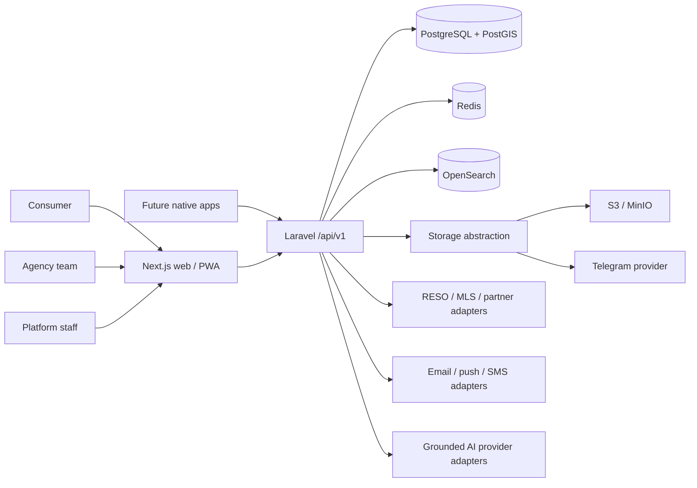
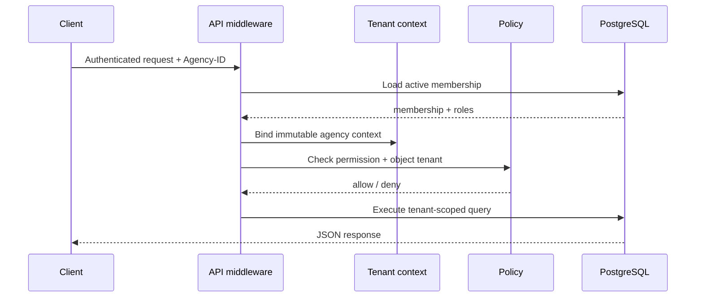

# Architecture assessment

## Existing repository assessment

The starting repository contained only a license and a one-line README, so there were no compatibility constraints, migrations, production data, or legacy contracts to preserve. A modular monolith is the right first architecture: it keeps cross-domain transactions and operational complexity manageable while retaining clean boundaries that can later be extracted around search, media, notifications, realtime messaging, and ingestion.

## Assumptions

1. The first commercial region and regulatory jurisdiction are not yet fixed. Currency, units, locale, consent, retention, and fair-housing policy remain configuration or policy modules.
2. Agencies are the tenant boundary. A user may belong to multiple agencies and must explicitly select an active agency context.
3. PostgreSQL/PostGIS is authoritative. OpenSearch, Redis, analytics stores, and CDN caches are derived or ephemeral.
4. The first-party web application uses secure Sanctum cookie sessions; future native and partner clients use scoped tokens/OAuth.
5. Exact property location may be private. Public projections can use an approximate point while the authoritative point remains restricted.
6. External real-estate data is unavailable at Phase 1. Provider interfaces are designed now; provider-backed modules remain hidden until licensed data exists.
7. Casaura is a working brand for this implementation and should receive legal/trademark review before public launch.
8. The API and web app deploy independently. The first implementation stays in one repository to keep contracts, tests, and local development coordinated.

## Proposed repository structure

```text
apps/
  api/
    app/Domain/             Domain services and ports
    app/Http/Controllers/   Versioned JSON transport layer
    app/Models/             Persistence models
    app/Policies/           Object-level authorization
    database/              Migrations, factories, seeders
    tests/                 Unit, feature, tenant and security tests
  web/
    src/app/               Next.js routes and server-rendered layouts
    src/components/        Brand, UI primitives, and feature components
    src/lib/               API clients, contracts, and utilities
    public/                Optimized project-owned assets
docs/
  architecture/            Decisions, diagrams, data model, delivery plan
  design/                  Accepted concepts and extracted tokens
infra/docker/              Local service configuration
packages/contracts/        OpenAPI and generated cross-app types
```

## System context



## Deployment topology

- `web`: stateless Next.js nodes behind a CDN/edge cache.
- `api`: stateless Laravel HTTP nodes, separate queue workers, scheduler, and websocket gateway.
- `postgres`: managed HA PostgreSQL with PostGIS and point-in-time recovery.
- `redis`: cache, rate limits, locks, queues, session support, and realtime fan-out.
- `opensearch`: derived search cluster; every index is rebuildable.
- `object storage`: private-by-default originals plus policy-controlled derivatives behind signed or proxied delivery.
- observability: OpenTelemetry-compatible traces, structured JSON logs, metrics, error tracking, and redaction at ingestion.

## Domain boundaries

| Boundary | Owns | Does not own |
| --- | --- | --- |
| Identity & access | users, sessions, MFA, roles, permissions | agency billing policy |
| Tenancy & agencies | agencies, branches, membership, verification, opening hours | physical properties |
| Catalogue | properties, listings, taxonomy, features, status/price history | full-text ranking engine |
| Search & discovery | query grammar, index projections, ranking, maps, alerts | authoritative listing state |
| Media | uploads, validation, derivatives, storage providers, delivery | listing publication rules |
| Engagement | reactions, favorites, collections, comments, ratings | CRM lead stages |
| Leads & viewings | inquiries, routing, pipeline, schedules, outcomes | messaging transport internals |
| Messaging & notifications | conversations, messages, preferences, adapters | lead ownership |
| Agency growth | storefront, newsletter, analytics, demand intelligence | global moderation |
| Integrations & provenance | providers, mappings, sync, raw records, deduplication | consumer-facing editorial copy |
| Trust & moderation | verification, reports, cases, sanctions, audit | billing settlement |
| Entitlements & billing | plans, subscriptions, quotas, promotion policy, invoices | feature implementation |
| Platform configuration | flags, settings, CMS, SEO configuration | infrastructure secrets in source control |

Boundaries communicate through application services and domain events. Controllers never query another tenant by an unscoped identifier. Cross-boundary projections are replaceable and never become the source of truth.

## Critical flows

### Request authorization



### Search indexing

`listing transaction → outbox event → queue → projection builder → OpenSearch alias`. Search results return listing IDs; restricted/source-sensitive fields are hydrated through authorized API projections. Reindexing writes a new versioned index and atomically swaps the alias.

### Media upload

`authenticated upload → tenant quota → extension/size check → detected MIME → hash → isolated malware/metadata processing → derivatives → StorageProviderInterface → media record → publishable state`. Telegram is one adapter and is never referenced from catalogue business logic.

### Data ingestion

`provider adapter → raw immutable envelope → mapping version → canonical validation → provenance records → identity candidates → human review when uncertain → listing/property transaction → indexing event`.

## Key architectural decisions

- Modular monolith first; asynchronous boundaries and stable ports make later extraction possible without distributed transactions on day one.
- UUIDv7-compatible IDs at public/domain boundaries; opaque IDs reduce enumeration and support distributed ingestion.
- Server-side tenant context plus policies and tenant-scoped relationships; frontend filtering is never an authorization control.
- PostgreSQL row-level security is a defense-in-depth deployment option after connection-pooling strategy is fixed, not the only tenant boundary.
- Transactional outbox for search, analytics, and notifications in Phase 2 to prevent dual-write loss.
- Feature availability resolves in this order: emergency environment override → agency override → plan entitlement → global default. Every change is audited.
