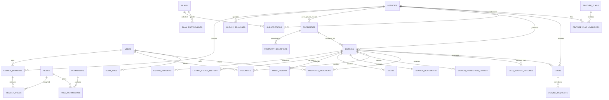

# Domain model and database design

## Core ER diagram

## Phase 1 physical tables

| Table | Important fields and constraints |
| --- | --- |
| `users` | UUID PK; unique case-normalized email; verified/suspended timestamps; locale/timezone; encrypted/hashed credentials |
| `agencies` | UUID PK; unique slug; legal/profile fields; verification/status enums; owner user FK; timezone; soft delete only for business recovery |
| `agency_branches` | UUID PK; `agency_id`; slug unique per agency; address/location placeholders; `is_primary` |
| `agency_members` | UUID PK; unique `(agency_id,user_id)`; status; job title; invited/accepted timestamps |
| `roles` | UUID PK; optional `agency_id`; system roles immutable; unique scoped slug |
| `permissions` | UUID PK; unique machine name such as `agency.manage_members` |
| `role_permissions` | composite unique role/permission FKs |
| `member_roles` | composite unique agency-member/role FKs; role scope must match member agency or be global |
| `plans` | UUID PK; unique slug; active/public flags; price metadata (no processor secrets) |
| `plan_entitlements` | unique plan/key; typed JSON value; optional quota/reset period |
| `subscriptions` | agency FK; plan FK; status; promotion/trial/free-until/current-period/billing timestamps |
| `feature_flags` | unique key; global default; environment rules JSON; description; history timestamps |
| `feature_flag_overrides` | unique `(feature_flag_id, scope_type, scope_id)`; nullable boolean/value; validity window |
| `audit_logs` | append-only UUID PK; actor, agency, action, entity, before/after JSON, IP, request ID, timestamp |
| `personal_access_tokens` | Sanctum token hashes and abilities; never store plaintext tokens |

## Phase 2 physical tables

| Table | Important fields and constraints |
| --- | --- |
| `property_types` | UUID PK; globally unique stable slug; category and active state |
| `amenities` | UUID PK; globally unique stable slug; presentation group and active state |
| `property_feature_definitions` | UUID PK; unique slug; typed value contract, unit, and JSON validation rules |
| `addresses` | UUID PK; required agency ownership; normalized address and private coordinate fields; tenant/locality index |
| `properties` | UUID PK; agency, property type, optional address; canonical bedrooms, bathrooms, metric area; recoverable soft delete |
| `property_identifiers` | UUID PK; property, scheme, value, source; unique property/scheme/value identity |
| `listings` | UUID PK; agency/property/creator; unique agency reference; intent, workflow state, copy, minor-unit price, optimistic version, quality score, transition timestamps; tenant workflow index; soft delete |
| `property_feature_values` | One JSON value per property/feature definition; application layer enforces the definition’s declared type |
| `property_amenities` | Composite property/amenity PK for deterministic synchronization |
| `listing_versions` | Immutable unique `(listing_id, version)` JSON snapshots with actor and timestamp |
| `listing_status_history` | Append-only from/to state, actor, review note, and timestamp |
| `price_history` | Append-only minor-unit amount, ISO currency, actor, and effective timestamp |
| `media` | Agency/listing ownership; unique listing idempotency key; sniffed MIME, decoded dimensions, checksum, private object key, position, alt text; soft delete |
| `media_derivatives` | Unique media/kind private WebP derivative metadata; storage keys never leave private API serializers |

## Phase 3 physical tables and extensions

| Table or extension | Important fields and constraints |
| --- | --- |
| `listings.slug` | Stable public slug paired with the opaque listing UUID in canonical property URLs |
| `addresses` public-location fields | Explicit `public_location_policy` plus nullable public coordinates; exact private coordinates remain tenant-only |
| `search_documents` | One public-safe document per published listing; denormalized text, facts, features, amenities, agency state, media metadata, public location, projection version, and listed timestamp |
| `search_projection_outbox` | Idempotent per-listing operation/version queue with attempts, processed/failure timestamps, and last error for rebuildable search delivery |
| `favorites` | Unique `(user_id, listing_id)` private account relationship with cascading ownership constraints |
| `property_reactions` | Unique `(user_id, listing_id)` private `like`/`dislike` state; replacement does not create duplicate reactions |
| PostgreSQL spatial extensions | PostGIS geography points and GiST indexes for public and private locations; SQLite stores equivalent scalar coordinates for deterministic local tests |

## Planned marketplace tables

The following are designed now and delivered by vertical slice, not as empty speculative migrations:

- Catalogue extensions: `listing_sources`, `rooms`, `developments`, `buildings`, `units`.
- Geography: `locations`, `geographic_boundaries`, parcel/cadastral provider references.
- Media extensions: `floor_plans`, `property_documents`, `upload_sessions`, `storage_migrations`.
- Discovery/engagement: `collections`, `collection_members`, `collection_properties`, `property_comments`, `property_ratings`, `saved_searches`, `search_alerts`, `search_demand_events`.
- CRM/collaboration: `leads`, `lead_status_history`, `viewing_requests`, `open_houses`, `conversations`, `conversation_participants`, `messages`, `notifications`.
- Agency growth: `agency_opening_hours`, `agency_verifications`, `agents`, `newsletter_subscribers`, `newsletter_campaigns`, `newsletter_events`, `analytics_events`.
- Integrations: `real_estate_data_providers`, `provider_connections`, `data_source_records`, `field_mappings`, `sync_jobs`, `import_errors`, `duplicate_candidates`.
- Trust/admin: `moderation_cases`, `abuse_reports`, `settings`, `cms_entries`, `invoices`.

## Index strategy

- B-tree: tenant FK first for every agency-owned list/query, e.g. `(agency_id, status, created_at desc)`.
- Partial: active listings and pending moderation queues.
- GiST: exact/public property points, service polygons, geography boundaries, drawn searches.
- GIN/trigram: normalized addresses, identifiers, reference numbers, and deduplication candidates.
- Unique: source identity `(provider_id, resource, external_record_id)` and per-agency slugs/reference IDs.
- BRIN: append-only analytics, audit, and ingestion events once tables become large.
- Cursor pagination uses a stable compound sort `(rank_or_timestamp, id)`; no deep offset pagination.

## Constraints and invariants

- A listing references one physical property but does not own its identity.
- An agency can never assign a private record to another agency through mass assignment.
- Status and price changes append history in the same transaction as the current value update.
- Monetary values use integer minor units plus ISO 4217 currency; measurements use canonical metric values with display conversion.
- External fields store field-level provenance when they affect consumer-visible facts.
- Uncertain duplicate candidates never auto-merge. A merge is reversible and preserves every source/listing record.

## Tenant isolation model

Agency-owned tables carry a non-null `agency_id` unless a documented shared/public record requires otherwise. API middleware resolves the active membership from the authenticated user and `Agency-ID` header. Policies check both capability and object ownership. Repository/application queries accept tenant context; background jobs serialize the tenant ID and re-resolve it before work. Tests exercise guessed UUIDs and cross-agency list/read/update/delete attempts.

PostgreSQL RLS can add a second barrier using a transaction-local `app.agency_id`. It will be enabled only after queue, migration, support-access, and connection-pool behavior are covered by integration tests.

## Retention strategy

| Data | Default strategy |
| --- | --- |
| Audit/security events | 7 years or jurisdiction policy; append-only; tightly restricted |
| Raw provider payloads | Provider contract maximum; hash/metadata may outlive payload for traceability |
| Search analytics | Pseudonymize quickly; aggregate after 90 days; delete raw identifiers by policy |
| Conversations/leads | Agency-configurable within legal minima/maxima; delete or anonymize on closure |
| Media | Quarantine on delete; purge originals/derivatives after recovery window unless legal hold |
| Account data | Export then delete/anonymize workflow; preserve only lawful financial/security records |
| Backups | Encrypted rolling retention with deletion propagation schedule and tested restore |

## Provenance model

`data_source_records` stores provider, resource, external ID, fetched/changed timestamps, sync status, raw hash, mapping version, rights snapshot, and optionally encrypted/compressed raw payload. Consumer-visible canonical fields can point to a source-field record. Corrections append a new mapping/result version rather than overwriting diagnostic history.

## RESO mapping strategy

1. Provider adapters implement `RealEstateDataProviderInterface` and return versioned neutral envelopes.
2. Connections pin provider-specific Data Dictionary/resource versions and contractual display rules.
3. Declarative mappings translate provider fields/enums/units to canonical DTOs; mappings are versioned and testable with fixtures.
4. Delta tokens and modification timestamps drive incremental imports; idempotency keys prevent replay duplication.
5. Required attribution, photo rights, retention, visibility, and refresh requirements travel with every record.
6. Validation failures enter a retryable import-error queue; source deletions become explicit expiry/withdrawal events.
7. Add/Edit capability is an optional provider port and never assumed from read access.
